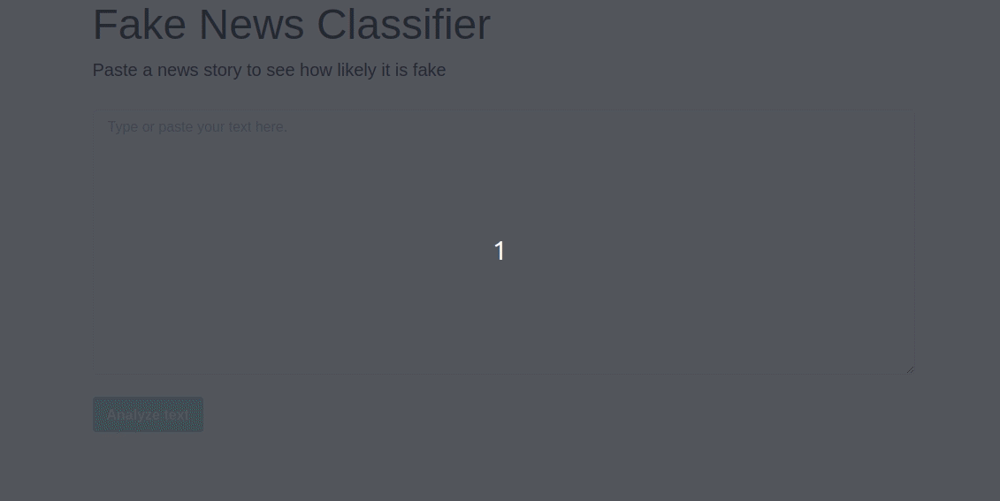

# Fake News Classifier
## Overview
This is an LSTM RNN model that classifies news stories as fake or not.  
At this point, the answer is the probability of a given story to be fake.

The data for training this model is taken from: https://www.kaggle.com/clmentbisaillon/fake-and-real-news-dataset

The app uses Flask as the backend service. Model is stored on S3.

## Usage

## TODO
1. Improve logging